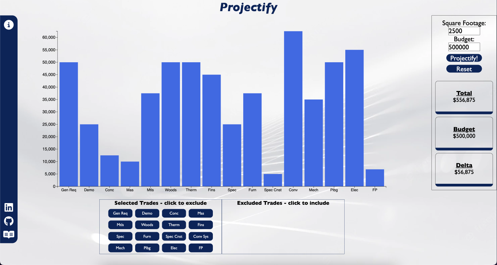
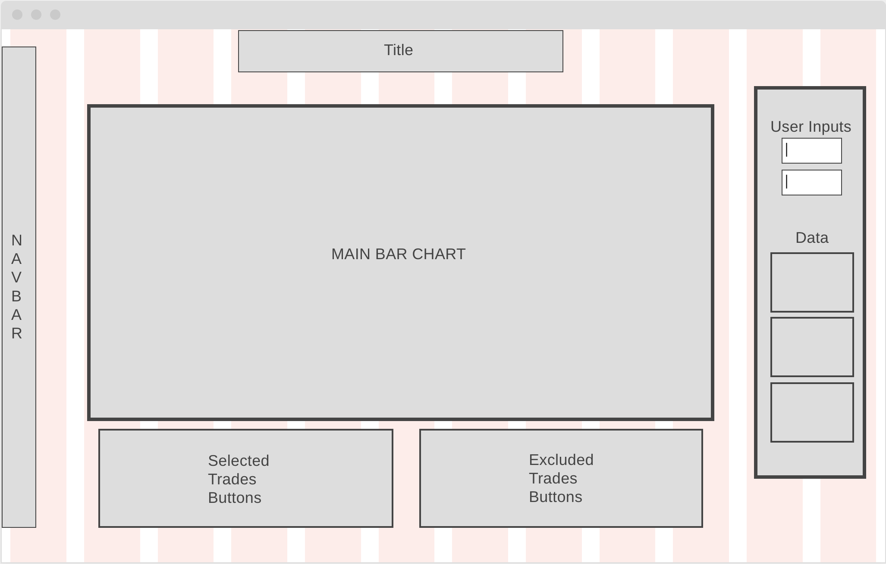

# Projectify

## DESCRIPTION

[Projectify](https://jkhbuild.github.io/Projectify/) is a single-page, construction budget generating webapp that aids real-estate developers and prospective tenants in understanding cost feasibility of a project at concept. Predict project costs by inputting square footage of the project area and applying $/SF rates based on construction type (medical office, office, warehouse). All data is visualized on a dynamic bar chart that can be adjusted to understand where scope reduction is needed.
<br>
<br>
Ready to ask the bank for a loan, or have a presentation to your project's governing town/village?
Project your project’s budget with projectify today!

)

## WIREFRAME

)

## FUNCTIONALITY

1. Display projected costs on a bar chart using d3 libararies. The user's inputed square footage is multiplied across the rates provided in JSON.

```js
createChart(data, sf = 0) {
    for (let i = 0; i < data.length; i++) {
      data[i].rate *= sf;
    }

    this.updateChart(data);
  }

  updateChart(data) {
    this.svg = d3
      .select("#main-chart")
      .append("svg")
      .attr("height", this.height - this.margin.top - this.margin.bottom)
      .attr("width", this.width)
      .attr("viewBox", [0, 0, this.width, this.height]);

    this.x = d3
      .scaleBand()
      .domain(d3.range(data.length))
      .range([this.margin.left, this.width - this.margin.right])
      .padding(0.1);

    this.y = d3
      .scaleLinear()
      .domain([0, d3.max(data.map((e) => e.rate))])
      .range([this.height - this.margin.bottom, this.margin.top]);

    this.svg
      .append("g")
      .attr("fill", "royalblue")
      .selectAll("rect")
      .data(data)
      .join("rect")
      .attr("x", (d, i) => this.x(i))
      .attr("y", (d) => this.y(d.rate))
      .attr("height", (d) => this.y(0) - this.y(d.rate))
      .attr("width", this.x.bandwidth());

    function xAxis(g) {
      g.attr("transform", `translate(0, ${this.height - this.margin.bottom})`)
        .call(d3.axisBottom(this.x).tickFormat((i) => data[i].trade))
        .attr("font-size", "16px");
    }

    function yAxis(g) {
      g.attr("transform", `translate(${this.margin.left}, 0)`)
        .call(d3.axisLeft(this.y).ticks(null, data.format))
        .attr("font-size", "18px");
    }

    this.svg.append("g").call(xAxis.bind(this));
    this.svg.append("g").call(yAxis.bind(this));
    this.svg.node();
  }
```

2. Remove trades from the X-axis if not applicable to the project.

```js
const tradesExcludedDiv = document.getElementById("trades-excluded");
const tradesSelectedDiv = document.getElementById("trade-selector");
let excluded = [];
if (tradesSelectedDiv) {
  tradesSelectedDiv.addEventListener("click", excludeTrade);
}
function excludeTrade(e) {
  let clicked = e.target;
  if (clicked.className === "trade") {
    tradesExcludedDiv.appendChild(e.target);
    for (let i = 0; i < dup.length; i++) {
      if (dup[i].trade === clicked.id) {
        excluded.push(dup[i]);
        dup = dup.slice(0, i).concat(dup.slice(i + 1));
      }
    }
    chart.deleteChart();
    chart.updateChart(dup);
    chart.getTotal(dup, budget);
  }
}
```

3. Re-include removed trades.

```js
let tradesExcluded = document.getElementById("trades-excluded");
if (tradesExcluded) {
  tradesExcluded.addEventListener("click", includeTrade);
}
function includeTrade(e) {
  let clicked = e.target;
  if (clicked.className === "trade") {
    tradesSelectedDiv.appendChild(e.target);
    for (let i = 0; i < excluded.length; i++) {
      if (excluded[i].trade === clicked.id) {
        dup.push(excluded[i]);
        excluded = excluded.slice(0, i).concat(excluded.slice(i + 1));
      }
    }
    chart.deleteChart();
    chart.updateChart(dup);
    chart.getTotal(dup, budget);
  }
}
```

4. Reset graph to apply new user inputs. Trades are reset with the graph.

```js
function resetTrades() {
  for (let i = 0; i < excluded.length; i++) {
    let move = document.getElementById(excluded[i].trade);
    tradesSelectedDiv.appendChild(move);
  }
  excluded = [];
}

let reset = document.getElementById("reset-button");
if (reset) {
  reset.addEventListener("click", resetChart);
}

function resetChart(e) {
  chart.deleteChart();
  dup = dupData(Data);
  chart.createChart(dup);
  resetTrades();
}
```

5. Display totals and delta from budget.

```js
  getTotal(data, budget) {
    const totaldiv = document.getElementById("total-value");
    const budgetdiv = document.getElementById("budget-value");
    const deltadiv = document.getElementById("delta-value");
    let total = 0;
    for (let i = 0; i < data.length; i++) {
      total += data[i].rate;
    }

    const numFor = Intl.NumberFormat("en-US");
    const newTotal = numFor.format(total);
    const newBudget = numFor.format(budget);
    const newDelta = numFor.format(total - budget);
    totaldiv.innerHTML = `$${newTotal}`;
    budgetdiv.innerHTML = `$${newBudget}`;
    deltadiv.innerHTML = `$${newDelta}`;
  }
```

## TECHNOLOGIES

- Vanilla Javascript
- Webpack
- D3 Library

## IMPLEMENTATION TIMELINE

- Thurs / Fri: Setup project. Research on implementing different features
- Weekend: Work on getting JSON preloaded with cost data. Create classes. Display Charts
- Monday: Get web app to display charts
- Tuesday: Continue chart display and functionality
- Wednesday: Styling and double-checking functionality. Complete bonus features
- Thursday: Polish project. Present.
